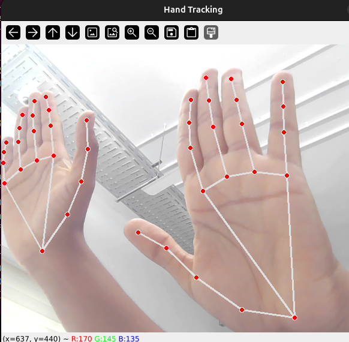
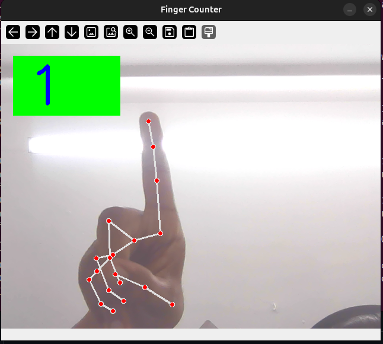
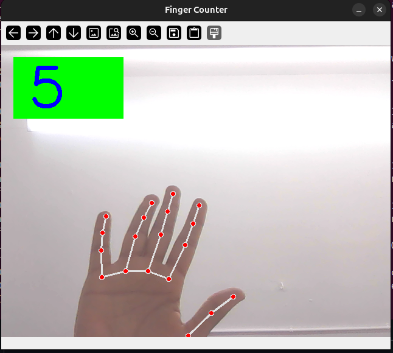
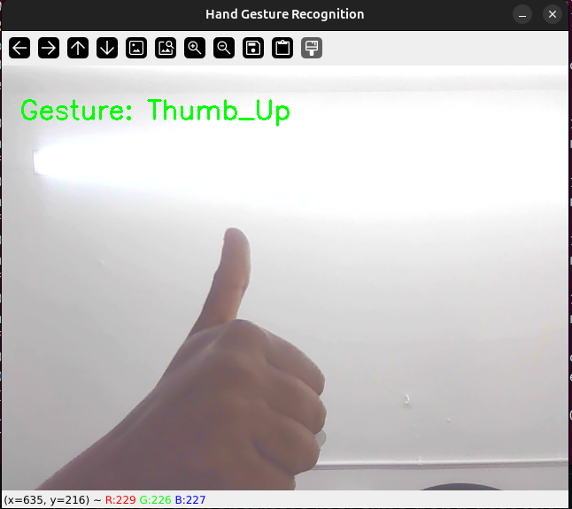
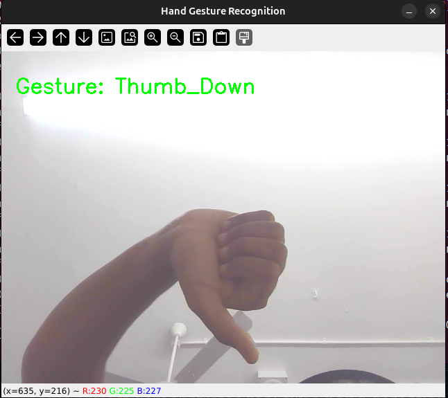
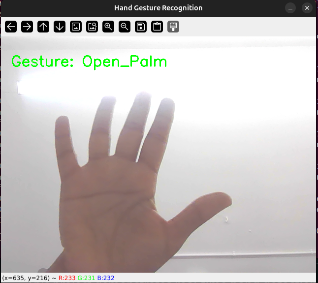
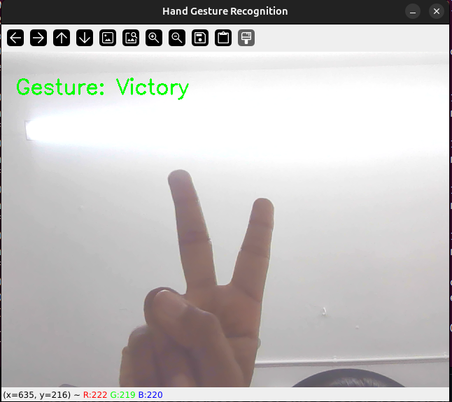
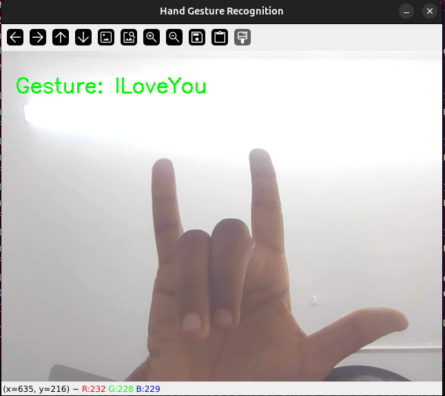

# 1. ✋ Hand Tracking using OpenCV and MediaPipe

## 📌 Overview

This project demonstrates **real-time hand detection and tracking** using **OpenCV** and **MediaPipe Hands**. The system captures video from a webcam, detects hands in each frame, and overlays **21 hand landmarks** along with their skeletal connections.

MediaPipe’s hand tracking model is optimized for **real-time performance** and can track multiple hands simultaneously, making it suitable for applications such as **gesture recognition, virtual control systems, and human–computer interaction**.

---

## ✨ Features

*  Real-time **hand detection and tracking**
*  Detects **up to 2 hands simultaneously**
*  Displays **21 hand landmarks per hand**
*  Draws **hand skeleton connections**
*  Works with a **webcam feed**
*  Lightweight and **runs in real time**

---

##  Technologies Used

*  **Python**
*  **OpenCV** – for video capture and display
*  **MediaPipe** – for hand detection and landmark tracking

---

## 📦 Installation


### Install dependencies

```bash
pip install opencv-python mediapipe
```

---


## ⚙️ How It Works

1️⃣ The webcam captures frames using **OpenCV **

2️⃣ Each frame is converted from **BGR → RGB ** format

3️⃣ MediaPipe processes the frame to detect hands

4️⃣ If hands are detected:

*  **21 hand landmarks** are identified
*  Landmarks and their connections are drawn on the frame
  
5️⃣ The processed frame is displayed in a window 

---

## 🖐 Hand Landmark Structure

Each detected hand contains **21 landmarks**, representing key points on the hand.

Examples:

| 🔢 Landmark ID | 📍 Description      |
| -------------- | ------------------- |
| 0              | Wrist               |
| 4              | Thumb Tip           |
| 8              | Index Finger Tip    |
| 12             | Middle Finger Tip   |
| 16             | Ring Finger Tip     |
| 20             | Pinky Tip           |

These landmarks can be used for:

*  Gesture recognition
*  Finger tracking
*  Distance measurement between fingers
*  Human–computer interaction systems

---

## 🚀 Applications

This hand tracking system can be extended to build:

*  **Hand gesture recognition**
*  **Virtual mouse**
*  **Finger-based volume control**
*  **Sign language recognition**
*  **Augmented reality interactions**
*  **Robotics control using gestures**

---

##  📷 Output:




## 🙌 Acknowledgements

*  **Google MediaPipe** for providing the hand tracking model
*  **OpenCV** for real-time image processing
---


# 2.  ✋ Finger Counter using OpenCV and MediaPipe

## 📌 Overview

This project demonstrates a **real-time finger counting system** using **OpenCV** and **MediaPipe Hands**. The program detects hands from a webcam feed, tracks **21 hand landmarks**, and determines how many fingers are raised.

The system analyzes the position of finger tips relative to their joints to determine whether each finger is **open or closed**, and then displays the total number of raised fingers on the screen.

This type of system is commonly used in **gesture recognition, touchless interfaces, and human–computer interaction applications**.

---

## ✨ Features

*  Real-time **hand detection and tracking**
*  **Counts raised fingers automatically**
*  Supports **up to 2 hands simultaneously**
*  Uses **21 MediaPipe hand landmarks**
*  Displays the **total finger count on screen**
*  Lightweight and runs in **real-time**

---

## 🛠 Technologies Used

*  **Python**
*  **OpenCV** – webcam capture and display
*  **MediaPipe Hands** – hand tracking and landmark detection

---

## 📦 Installation

### 1️⃣ Install required libraries

```bash
pip install opencv-python mediapipe
```

---

## ⚙️ How It Works

1️⃣ The webcam captures frames using **OpenCV**

2️⃣ Each frame is flipped horizontally for natural interaction

3️⃣ The frame is converted from **BGR → RGB**

4️⃣ **MediaPipe Hands** detects hands and returns **21 landmark points**

5️⃣ The program checks whether each finger is **open or closed**:

* 👍 Thumb → compared horizontally
* ☝️ Other fingers → compared vertically

6️⃣ The number of raised fingers is calculated and displayed on the screen.

---


## 🚀 Applications

This finger counting system can be extended to build:

*  **Hand gesture recognition**
*  **Virtual mouse control**
*  **Gesture-based volume control**
*  **Touchless gaming interfaces**
*  **Robot control using finger gestures**
*  **Human–computer interaction systems**

---

## 📷 Output:

  <p align="center">
  
  
  
  
  
  </p>

 ---

# 3. ✋ Hand Gesture Recognition using MediaPipe and OpenCV

## 📌 Overview

This project demonstrates **real-time hand gesture recognition** using **OpenCV** and **MediaPipe Gesture Recognizer**. The system captures video from a webcam, detects a hand, and recognizes predefined gestures using the **MediaPipe Gesture Recognition model (`gesture_recognizer.task`)**.


## ✨ Features

*  **Real-time hand gesture recognition**
*  Uses **MediaPipe's pretrained gesture recognition model**
*  Detects common gestures automatically
*  Lightweight and **runs in real-time**
*  Works directly with a **webcam**
*  Gesture prediction with **confidence score filtering**

---

## 🛠 Technologies Used

*  **Python**
*  **OpenCV** – video capture and visualization
*  **MediaPipe Tasks API** – gesture recognition
*  **NumPy** – image processing

---

## 📦 Installation

### 1️⃣ Install required libraries

```bash id="zv9nqf"
pip install opencv-python mediapipe numpy
```

---

### 2️⃣ Download the MediaPipe Gesture Model

Download the model:

```
gesture_recognizer.task
```

Place the file in the **same directory as the Python script**.

You can find it in the **MediaPipe model repository**.

---


## ⚙️ How It Works

1️⃣ The webcam captures frames using **OpenCV**

2️⃣ Each frame is flipped horizontally to create a **mirror effect**

3️⃣ The frame is converted from **BGR → RGB**

4️⃣ The image is converted into a **MediaPipe image object**

5️⃣ The **Gesture Recognizer model** processes the frame

6️⃣ If a gesture is detected:

* The gesture name is extracted
* The prediction confidence is checked

7️⃣ The detected gesture is displayed on the screen.

---

##  Supported Gestures

The default **MediaPipe Gesture Recognizer model** detects several predefined gestures:

| Gesture           | Description                |
| ----------------- | -------------------------- |
| 👍 **Thumb_Up**   | Thumbs up gesture          |
| 👎 **Thumb_Down** | Thumbs down gesture        |
| ✊ **Closed_Fist** | Closed hand                |
| 🖐 **Open_Palm**  | Open hand                  |
| ✌ **Victory**     | Two-finger victory sign    |
| ☝ **Pointing_Up** | Index finger pointing up   |
| 🤟 **ILoveYou**   | Sign language "I love you" |

---

##  📷 Output:

<p align="center">
  
  
  
  
  
  
  </p>


## 🚀 Applications

This system can be used to build many gesture-based applications:

*  **Robot control using hand gestures**
*  **Touchless gaming controls**
*  **Gesture-based computer interaction**
*  **Smart home control systems**
*  **Sign language recognition**
*  **Human–computer interaction systems**

---

# 4. 🖐️ AI Virtual Whiteboard using Hand Tracking

## 📌 Overview

The **AI Virtual Whiteboard** is a computer vision application that allows users to draw on a virtual canvas using **hand gestures captured through a webcam**.  

The system uses **MediaPipe Hand Tracking** to detect finger positions and enables drawing, erasing, undoing, saving, and clearing drawings in real time. It also includes **basic shape recognition** to detect shapes like rectangles and circles drawn on the canvas.

This project demonstrates how **gesture-based interaction** can replace traditional input devices for creative and educational applications.

---

## 🎯 Objective

The objective of this project is to create a **gesture-controlled drawing interface** that:

- Uses hand tracking to control drawing
- Provides a virtual whiteboard interface
- Supports multiple drawing tools and colors
- Recognizes basic shapes
- Allows saving and editing drawings in real time

---

## ⚙️ How It Works

```
Webcam Input
     │
     ▼
Hand Detection (MediaPipe)
     │
     ▼
Finger Position Tracking
     │
     ▼
Gesture Detection
     │
     ▼
Drawing / Tool Selection
     │
     ▼
Canvas Update
     │
     ▼
Shape Recognition
     │
     ▼
Display Virtual Whiteboard
```

---

## 🛠️ Technologies Used

- **Python**
- **OpenCV** – Computer vision and image processing
- **MediaPipe** – Hand tracking and landmark detection
- **NumPy** – Image canvas processing
- **Time module** – File naming and timing

---

## ✨ Features

-  Real-time hand gesture tracking
-  Virtual drawing canvas
-  Brush tool for drawing
-  Eraser tool
-  Undo functionality
-  Save drawings as images
-  Clear canvas
-  Color palette selection
-  Shape recognition (Circle and Rectangle)
-  Webcam-based interaction

---

## 🎮 Controls

### Gesture Modes

**Selection Mode**
- Raise **Index Finger + Middle Finger**
- Used to select tools or colors.

**Drawing Mode**
- Raise **Index Finger only**
- Used to draw on the canvas.

---

## 🧰 Tools Available

| Tool | Function |
|-----|-----|
| Brush | Draw lines on the canvas |
| Eraser | Remove drawn content |
| Undo | Revert last drawing action |
| Save | Save drawing as an image |
| Clear | Clear entire canvas |

---

## 🎨 Color Palette

Users can choose from multiple colors:

- Blue  
- Green  
- Red  
- Yellow  
- Purple  
- Black (used as eraser)

---

## 📦 Installation

### 1️⃣ Install Required Libraries

```bash
pip install opencv-python mediapipe numpy
```

---

## 🧠 Shape Recognition

The system detects shapes drawn on the canvas using **contour approximation**:

- Shapes with **4 vertices → Rectangle**
- Shapes with **more than 6 vertices → Circle**

Detected shapes are labeled automatically on the canvas.


---

## 🌍 Applications

- Digital classrooms and online teaching
- Gesture-based creative tools
- Touchless drawing systems
- Interactive presentations
- Computer vision research

---

